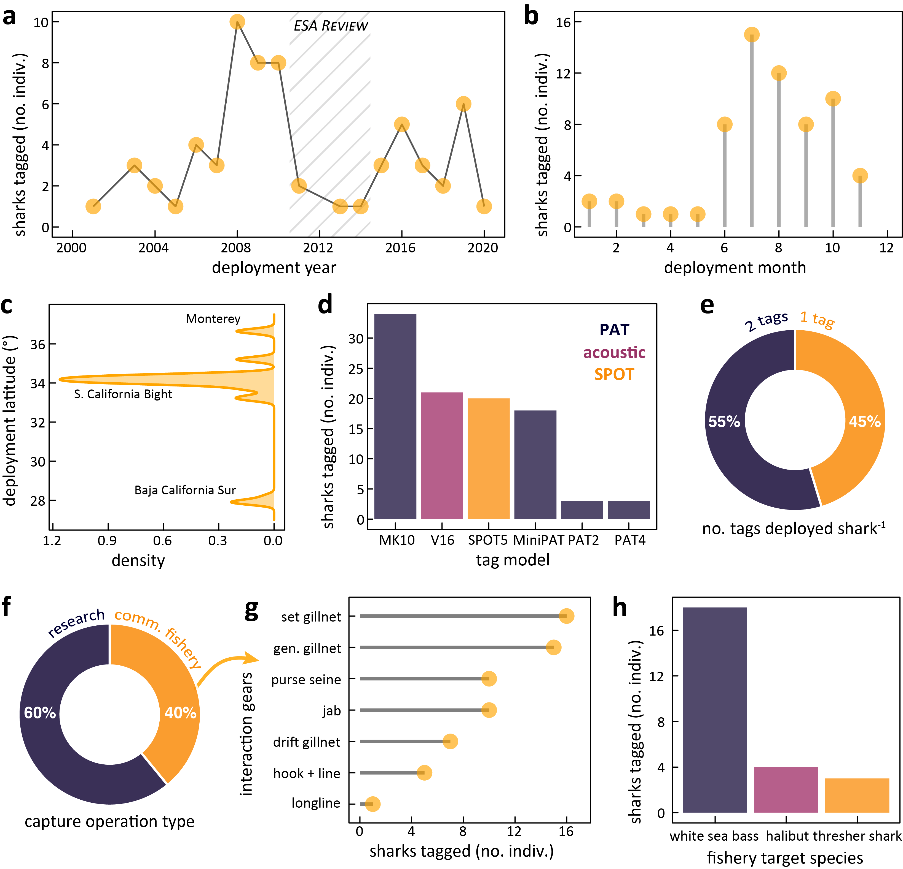

<h1 align="center">JWS_data</h1>
<p align="center"><b>Figure and metadata code for the juvenile white shark biologging database (northeast Pacific, 2001–2020)</b></p>

<p align="center">
  
</p>

<p align="center">
  <a href="https://doi.org/10.1038/s41597-022-01235-3"></a>
  <a href="https://doi.org/10.24431/rw1k6c3"></a>
  <a href="LICENSE"></a>
  <a href="https://creativecommons.org/licenses/by/4.0/"></a>
  
</p>

This repository holds the data-wrangling and visualization code behind *A biologging
database of juvenile white sharks from the northeast Pacific* (O'Sullivan et al. 2022,
*Scientific Data*). From 2001–2020 the Monterey Bay Aquarium's Juvenile White Shark
Project deployed 79 electronic tags on 63 juvenile white sharks (*Carcharodon
carcharias*) in the southern California Current, recording pressure, temperature, and
light-level data and computing depth and geolocation. The full telemetry records and
metadata live at the U.S. Animal Telemetry Network (ATN) Data Assembly Center; **the
code here is the visualization layer** — it turns the curated tag metadata into the
field-program and demographic summary figures of the manuscript, plus a small utility
for correcting PAT depth-sensor drift.

---

## Citation

> O'Sullivan J, Lowe CG, Sosa-Nishizaki O, Jorgensen SJ, Anderson JM, Farrugia TJ,
> García-Rodríguez E, Lyons K, McKinzie MK, Oñate-González EC, Weng K, White CF,
> Winkler C, Van Houtan KS. 2022. A biologging database of juvenile white sharks from
> the northeast Pacific. *Scientific Data* 9:142.
> https://doi.org/10.1038/s41597-022-01235-3

<details>
<summary>BibTeX</summary>

```bibtex
@article{osullivan2022jws,
  title   = {A biologging database of juvenile white sharks from the northeast Pacific},
  author  = {O'Sullivan, John and Lowe, Christopher G. and Sosa-Nishizaki, Oscar and
             Jorgensen, Salvador J. and Anderson, James M. and Farrugia, Thomas J. and
             Garc{\'i}a-Rodr{\'i}guez, Emiliano and Lyons, Kady and McKinzie, Megan K. and
             O{\~n}ate-Gonz{\'a}lez, Erick C. and Weng, Kevin and White, Connor F. and
             Winkler, Chuck and Van Houtan, Kyle S.},
  journal = {Scientific Data},
  volume  = {9},
  pages   = {142},
  year    = {2022},
  doi     = {10.1038/s41597-022-01235-3}
}
```
</details>

**Data availability.** The telemetry records and metadata are publicly archived (CC-BY
4.0) at the ATN Data Assembly Center and the Research Workspace / DataONE member node,
with their own dataset DOI [10.24431/rw1k6c3](https://doi.org/10.24431/rw1k6c3). The
ATN data portal is at [portal.atn.ioos.us](https://portal.atn.ioos.us). This GitHub
repository provides only the figure code, not the raw tag archives. Users of the data
are asked to acknowledge the ATN and cite the data manuscript above.

---

## Repository structure

```
JWS_data/
├── data/
│   ├── jws_tag_metadata.csv   # one row per deployment record: capture, shark, and trip fields
│   └── jws_tag_types.csv      # one row per shark–tag: platform, make, model
├── scripts/
│   ├── figure_1_capture_program.R   # field-program metadata panels  → published Fig 2
│   ├── figure_2_shark_data.R        # shark demographic/deployment panels → published Fig 3
│   └── correct_depth_sensor.py      # standalone PAT depth-drift correction (not part of the figures)
├── plots/                     # exported figure panels (PDF): figure1a–h, figure2a–f
├── JWS_data.Rproj             # RStudio project (sets working dir to repo root)
├── LICENSE                    # MIT
└── README.md
```

The R scripts read data with **paths relative to the repository root** (e.g.
`read.csv('./data/jws_tag_metadata.csv')`). Open `JWS_data.Rproj` in RStudio — or
`setwd()` to the repo root — before running them.

---

## What the code does

Two short R scripts each build a series of `ggplot2` panels (sharing a `themeKV` theme)
from the curated metadata. They are intentionally simple — counts, histograms,
densities, donuts, and a couple of scatter/lollipop summaries — and reproduce the
manuscript's metadata figures.

| Script | Builds (published) | Panels |
| --- | --- | --- |
| `figure_1_capture_program.R` | **Fig 2** (a–h) | tags per year, tags per month, release latitude, tag model by platform, tags-per-shark donut, capture-operation-type donut, capture-gear lollipop, target-fishery bar. |
| `figure_2_shark_data.R` | **Fig 3** (a–f) | total-length histogram, sex donut, deployment-duration density, duration-by-year boxplots, distance-traveled histogram, distance-vs-duration scatter with LOESS. |

> **A note on figure numbers.** The script filenames and in-code comments say "figure 1"
> and "figure 2," but those refer to an earlier draft. In the published paper, **Fig 1
> is photographs** of a tagging operation (no code); the metadata summaries built here
> are the paper's **Fig 2** (`figure_1_capture_program.R`) and **Fig 3**
> (`figure_2_shark_data.R`). The exported panels in `plots/` keep the old `figure1*` /
> `figure2*` names.

**`correct_depth_sensor.py`** is a standalone helper, separate from the figure
pipeline. For a Wildlife Computers archival depth time series it re-zeros the surface
each day — subtracting the daily maximum (shallowest) depth to remove slow sensor
drift — and writes a corrected `*_CD.csv`. It depends on `numpy`, `scipy`, `pandas`,
and `matplotlib` (the latter only for an optional, commented-out histogram-based
variant). It is provided for downstream depth analyses rather than to make any figure
in this paper.

---

## Data dictionary

### `data/jws_tag_metadata.csv`

64 deployment records (one per `SHARK_ID`; two are recapture/retag entries for animals
already in the table, consistent with the paper's 63 unique individuals), 41 columns.
The fields mirror the manuscript's **Table 1** — see the paper for the authoritative
definitions; the columns the figures actually use are:

| Column | Used for | Meaning |
| --- | --- | --- |
| `YEAR_CAP`, `MONTH_CAP` | Fig 2a–b, 3d | capture year and month (integer); `*_FRAC` variants give decimal dates |
| `LAT_REL`, `LON_REL` | Fig 2c | release location (decimal degrees) |
| `TAGS_NO` | Fig 2e | number of tags deployed on that shark |
| `INTERACTION` | Fig 2f | capture context: `research` vs. `fishery, commercial` |
| `CAPTURE_GEAR` | Fig 2g | gear used (gillnet subtypes, purse seine, hook+line, jab, …) |
| `TARGET_FISHERY` | Fig 2h | target species for commercially bycaught sharks (`NA` otherwise) |
| `TBL_cm` | Fig 3a | total body length at capture (cm) |
| `SEX` | Fig 3b | `F`, `M`, or `U` (undetermined) |
| `DEPLOY_DAYS` | Fig 3c–d, 3f | maximum tag deployment duration (days) |
| `DIST_KM` | Fig 3e–f | minimum linear surface distance, release → first/last position (km) |

Other columns carry tag identifiers (`PAT_*`, `SPOT_*`, `ACOUSTIC_ID`), end
dates/positions (`PAT_END`, `LAT_END_PAT`, `DIST_PAT`, …), transmission/recovery flags
(`PAT_RECOVERY`, `DATA_TRANS`, `DATA_BINNED`, `DATA_TS`), and free-text `COMMENTS`.
`ND` = tag not deployed, `DNT` = tag did not transmit, `NA` = not applicable/available.

### `data/jws_tag_types.csv`

99 shark–tag records (one row per tag deployed, so multi-tagged sharks recur), 4
columns: `SHARK_ID`, `TAG_TYPE` (`1_PAT`, `2_acoustic`, `3_SPOT`), `TAG_MAKE`
(Wildlife Computers or Vemco), and `TAG_MODEL`. By platform: **58 PAT** (MK10 ×34,
MiniPAT ×18, PAT2 ×3, PAT4 ×3), **20 SPOT** (SPOT5), and **21 acoustic** (Vemco V16).
This file drives the tag-model panel (Fig 2d).

---

## Requirements

**R ≥ 4.2** with:

```r
install.packages(c(
  "ggplot2", "ggthemes", "viridis",          # plotting
  "dplyr", "tidyr", "tidyverse", "forcats",  # wrangling
  "data.table", "plyr"                        # legacy helpers
))
```

**Python ≥ 3.9** (only for `correct_depth_sensor.py`): `numpy`, `scipy`, `pandas`,
`matplotlib`.

---

## Reproducing the figures

1. **Clone** the repository and open `JWS_data.Rproj` in RStudio (sets the working
   directory to the repo root, which the relative data paths rely on).
   ```bash
   git clone https://github.com/vanhoutan/JWS_data.git
   cd JWS_data
   ```
2. **Install** the R packages above.
3. **Run** `scripts/figure_1_capture_program.R` (paper Fig 2) and
   `scripts/figure_2_shark_data.R` (paper Fig 3). Each script renders its panels
   sequentially; the individual panels were composited into the final figures
   externally and are exported to `plots/`.

### Notes

- **Figure numbering.** Filenames/comments predate the final numbering — `figure_1*`
  builds the paper's Fig 2 and `figure_2*` builds Fig 3 (see the note above).
- **`load` order.** The R scripts attach `plyr` alongside `dplyr`; keep that order (or
  prefer `dplyr::` calls) if you refactor, to avoid `summarise()`/`group_by()` masking.
- **The Python helper is local-path bound.** `correct_depth_sensor.py` points `flist`
  at a hard-coded Windows path and carries an inline note addressed to a collaborator;
  repoint it to a relative `data/` path (and drop the note) before anyone runs it
  elsewhere. It expects an archival CSV with `Time` (`%Y-%m-%d %H:%M:%S`) and `Depth`
  columns and writes `<name>_CD.csv`.
- **`plots/` are PDFs.** GitHub won't render them inline; the banner above is generated
  from the metadata in `data/` (commit `header.png` alongside this README to display it).

---

## License

Code in this repository is released under the **MIT License** — see [`LICENSE`](LICENSE).
© 2026 Kyle Van Houtan. Note that the underlying telemetry data and metadata are
licensed separately as **CC-BY 4.0** through the ATN archive
([10.24431/rw1k6c3](https://doi.org/10.24431/rw1k6c3)).

---

## Authors & acknowledgments

The Juvenile White Shark Project was led by the Monterey Bay Aquarium in international
collaboration with California State University Long Beach, CICESE (Ensenada, Mexico),
Stanford University, and Aquatic Research Consultants, with cyberinfrastructure for the
ATN DAC built and maintained by Axiom Data Science. Figures and this code were prepared
by **K. Van Houtan** ([@vanhoutan](https://github.com/vanhoutan)); see the paper's
author-contributions and acknowledgments for the full team, and for the many students,
staff, interns, and commercial-fishery partners who made two decades of tagging
possible. The work was supported by members, visitors, and donors to the Monterey Bay
Aquarium.
